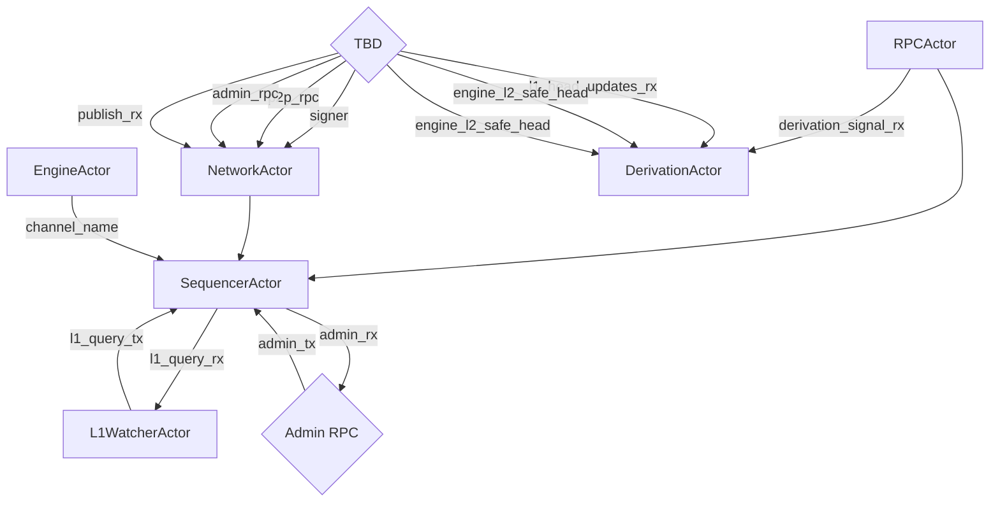

# Actors

The system comprises the following actors and connections

```mermaid
    flowchart TD

    seq[SequencerActor]
    eng[EngineActor]
    l1w[L1WatcherActor]
    net[NetworkActor]
    rpc[RPCActor]
    der[DerivationActor]
    adm{Admin RPC}
    tbd{TBD}

    %% Engine Actor


    %% RPC Actor

    %% L1 Watcher Actor

    seq -- l1_query_rx --> l1w


    %% Network Actor

    tbd -- signer --> net
    tbd -- p2p_rpc --> net
    tbd -- admin_rpc --> net
    tbd -- publish_rx --> net

    %% Sequencer Actor

    rpc --> seq
    net --> seq
    adm -- admin_tx --> seq
    l1w -- l1_query_tx --> seq
    eng -- channel_name --> seq
    rpc -- derivation_signal_rx --> der

    %% Derivation Actor

    tbd -- l1_head_updates_rx --> der
    tbd -- engine_l2_safe_head --> der
    tbd -- engine_l2_safe_head --> der

    seq -- admin_rx --> adm
```